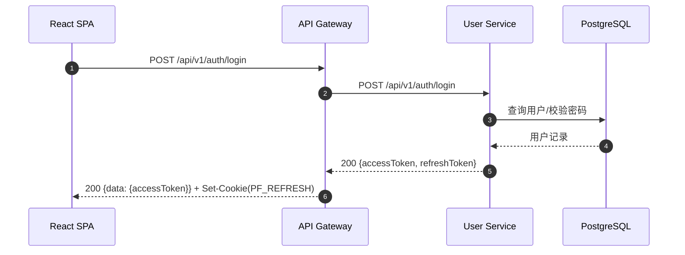
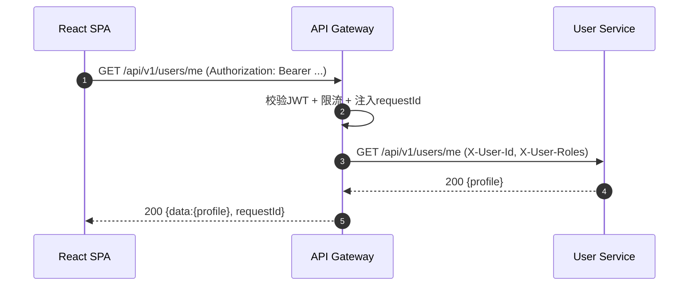
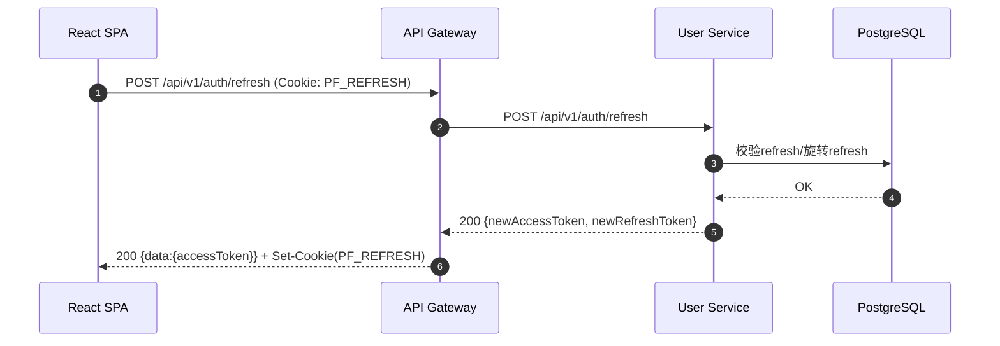
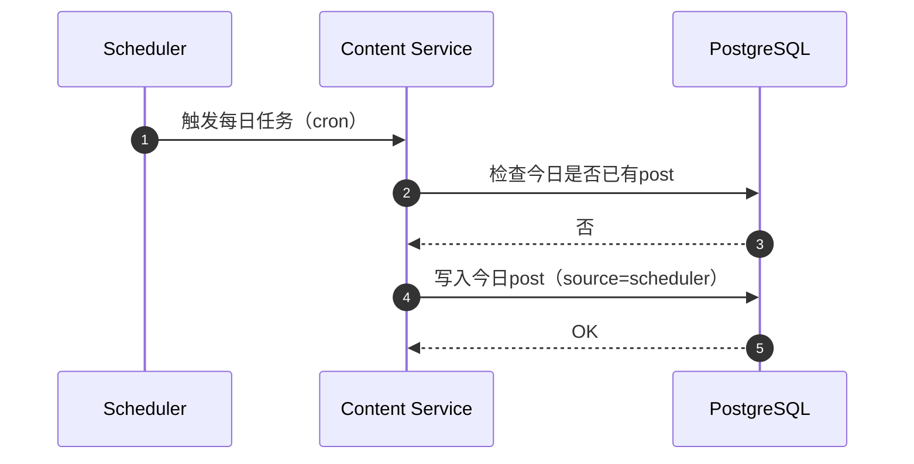
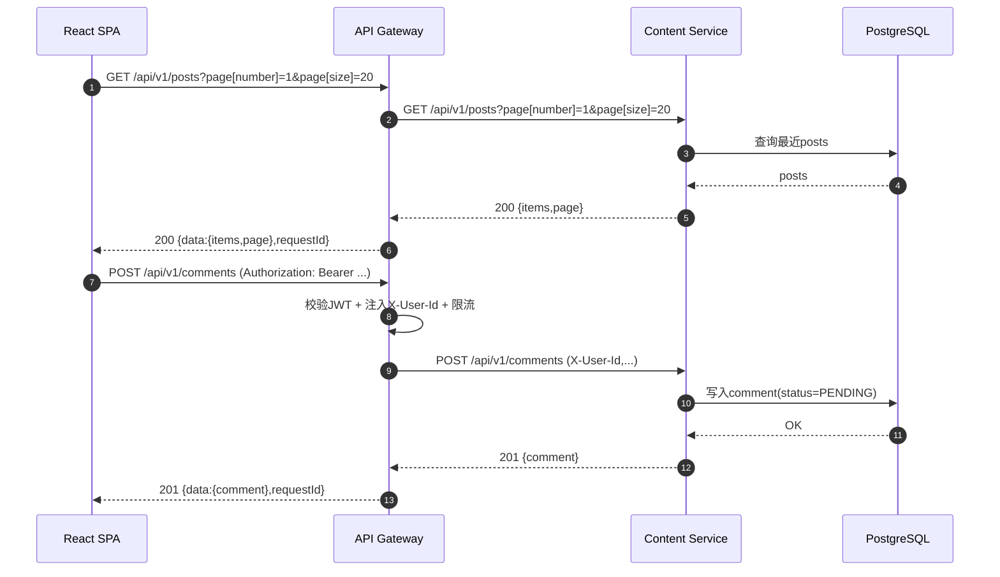
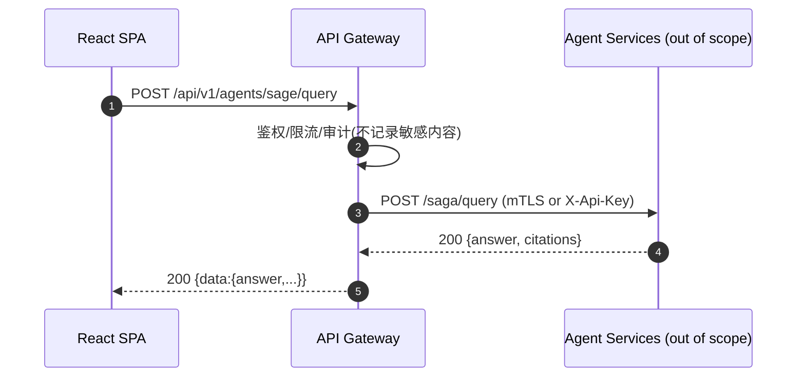

# PaperFlow 端到端 API 调用流程（v1）

本文覆盖 React SPA → 统一 API 网关 →（用户管理服务 / 内容服务）（Spring Boot） 的端到端调用流程，并定义下游 5-Agent 模块（不在本次范围内）的网关接入与治理约束。

## 0. 三层架构映射

- 表现层：React SPA（浏览器）
- 业务层：统一 API 网关（Spring Boot）+ 用户管理服务（Spring Boot）+ 内容服务（Spring Boot：每日帖子/评论/管理）
- 数据层：PostgreSQL（用户、帖子、评论等数据）；其他存储（如 MinIO、pgvector）作为下游业务能力由网关转发接入

## 1. 统一地址与命名

- Base URL（按环境）：`https://{env}.paperflow.example.com`
- API 前缀：`/api/v1`
- 网关到用户服务：`http://user-service:8081`（容器内）或 `http://localhost:8081`（本地）
- 网关到内容服务：`http://content-service:8082`（容器内）或 `http://localhost:8082`（本地）

## 2. 通用请求头（Request Headers）

- `Accept: application/json`
- `Content-Type: application/json`（有 body 时）
- `Authorization: Bearer <access_token>`（需要登录的接口）
- `X-Request-Id: <uuid>`（可选；缺省由网关生成并回传）
- `Idempotency-Key: <uuid>`（可选；用于幂等写操作，见 2.4）
- `X-Api-Version: 1`（可选；默认由路径 `/api/v1` 指定）

## 2.1 通用响应格式（Response Envelope）

成功响应：

```json
{
  "requestId": "8d5f5d3e-5c2c-4a74-93c9-9a9da6f8b9d1",
  "data": {},
  "links": [
    { "rel": "self", "href": "/api/v1/users/me" }
  ]
}
```

错误响应：

```json
{
  "requestId": "8d5f5d3e-5c2c-4a74-93c9-9a9da6f8b9d1",
  "error": {
    "code": "AUTH_INVALID_TOKEN",
    "message": "Invalid or expired token",
    "details": {
      "traceId": "01J8JQ2FQ1YQ7H3Z2Y4KQ2R3S4"
    }
  }
}
```

网关必须保证：

- 所有响应包含 `requestId`
- 业务服务的非规范错误被网关归一化为上述格式

## 2.2 错误码（Error Codes）

| HTTP | code | 说明 |
|---:|---|---|
| 400 | `REQ_VALIDATION_FAILED` | 参数校验失败 |
| 400 | `REQ_MALFORMED_JSON` | JSON 解析失败 |
| 401 | `AUTH_MISSING_TOKEN` | 缺少 Authorization |
| 401 | `AUTH_INVALID_TOKEN` | Token 无效或过期 |
| 403 | `AUTH_FORBIDDEN` | 权限不足 |
| 404 | `RES_NOT_FOUND` | 资源不存在 |
| 409 | `RES_CONFLICT` | 冲突（唯一键/状态机冲突等） |
| 412 | `REQ_PRECONDITION_FAILED` | 幂等/条件请求失败 |
| 415 | `REQ_UNSUPPORTED_MEDIA_TYPE` | 不支持的 Content-Type |
| 429 | `RATE_LIMITED` | 触发限流 |
| 500 | `SYS_INTERNAL_ERROR` | 未知内部错误 |
| 502 | `UPSTREAM_BAD_GATEWAY` | 上游服务错误/不可达 |
| 504 | `UPSTREAM_TIMEOUT` | 上游服务超时 |

## 2.3 鉴权方式（Auth）

### 2.3.1 用户鉴权：JWT（Access Token）

- SPA 登录后获得 `access_token`（JWT，短有效期，例如 15 分钟）
- 访问受保护资源时携带：`Authorization: Bearer <access_token>`

JWT Claims（建议）：

- `sub`: 用户 ID
- `roles`: 角色列表（如 `USER`/`ADMIN`）
- `iat`/`exp`: 签发/过期时间
- `jti`: token id（配合注销/黑名单策略）

### 2.3.2 刷新令牌：Refresh Token（HttpOnly Cookie）

- 网关在登录/刷新时设置 `Set-Cookie: PF_REFRESH=...; HttpOnly; Secure; SameSite=Lax; Path=/api/v1/auth/refresh`
- SPA 不读取 cookie，只调用刷新接口获取新的 access token

### 2.3.3 服务间鉴权（可选）：API Key / mTLS

用于网关 → 下游 Agent 服务（不在本次范围内）的调用：

- 首选 mTLS（生产）
- 备选 API Key（开发/测试），通过 `X-Api-Key` 或网关侧配置静态密钥

## 2.4 幂等策略（Idempotency）

适用范围：写接口（POST/PUT/PATCH/DELETE），尤其是支付类/导入类/上传类。

- 客户端生成 `Idempotency-Key`，网关记录 `{key, userId, method, path, bodyHash} → response`
- 同 key 重放：返回首次成功响应；若 bodyHash 不一致，返回 `412 REQ_PRECONDITION_FAILED`
- 默认缓存窗口：24h（可配置）

## 2.5 限流策略（Rate Limiting）

分层限流（由网关执行，用户服务不重复做强限流）：

1. 匿名级（按 IP）：注册/登录/刷新接口，如 `10 req/min/IP`
2. 用户级（按 `sub`）：业务接口，如 `120 req/min/user`
3. 客户端级（按 API Key）：网关访问下游 Agent 服务，如 `300 req/min/key`

网关响应：

- HTTP `429`
- 头：`Retry-After`、`X-RateLimit-Limit`、`X-RateLimit-Remaining`（可选）

## 2.6 版本管理规则（Versioning）

- 主版本（breaking）：URL 路径 `/api/v{major}`（如 `/api/v2`）
- 次版本（non-breaking）：响应头 `X-Api-Minor`（如 `1.3`），或 OpenAPI 文档标注
- 兼容策略：
  - 新增字段：只能追加，不能改类型/语义
  - 删除/改名字段：仅允许在新主版本
  - 错误码：只能新增，既有错误码语义不变

## 3. 时序图（Sequence Diagrams）

### 3.1 登录（Login）



### 3.2 访问受保护资源（Access Protected API）



### 3.3 Token 刷新（Refresh）



### 3.4 每日自动帖子生成（Scheduler → 内容服务）



### 3.5 获取每日帖子 + 发表评论（Feed & Comment）



### 3.6 网关转发到下游 Agent 服务（Out of Scope）



## 4. 典型接口定义（Request/Response Examples）

### 4.1 注册

`POST /api/v1/auth/register`

请求：

```json
{
  "email": "alice@example.com",
  "password": "******",
  "displayName": "Alice"
}
```

响应（201）：

```json
{
  "requestId": "…",
  "data": {
    "userId": "u_123",
    "email": "alice@example.com",
    "displayName": "Alice"
  },
  "links": [
    { "rel": "self", "href": "/api/v1/users/u_123" },
    { "rel": "login", "href": "/api/v1/auth/login" }
  ]
}
```

### 4.2 登录

`POST /api/v1/auth/login`

请求：

```json
{
  "email": "alice@example.com",
  "password": "******"
}
```

响应（200）：

```json
{
  "requestId": "…",
  "data": {
    "accessToken": "eyJhbGciOiJIUzI1NiIsInR5cCI6IkpXVCJ9..."
  },
  "links": [
    { "rel": "me", "href": "/api/v1/users/me" },
    { "rel": "refresh", "href": "/api/v1/auth/refresh" }
  ]
}
```

### 4.3 获取当前用户

`GET /api/v1/users/me`

响应（200）：

```json
{
  "requestId": "…",
  "data": {
    "userId": "u_123",
    "email": "alice@example.com",
    "displayName": "Alice",
    "roles": ["USER"]
  },
  "links": [
    { "rel": "self", "href": "/api/v1/users/me" },
    { "rel": "update", "href": "/api/v1/users/me" }
  ]
}
```

## 5. 网关错误归一化规则

- 上游服务（用户服务/Agent 服务）返回非规范 JSON：网关转为 `SYS_INTERNAL_ERROR` 或 `UPSTREAM_BAD_GATEWAY`
- 上游超时：网关返回 `504 UPSTREAM_TIMEOUT`
- 限流：网关返回 `429 RATE_LIMITED`（服务不应再次 429）
- 鉴权失败：网关返回 `401/403`，不向上游发请求
